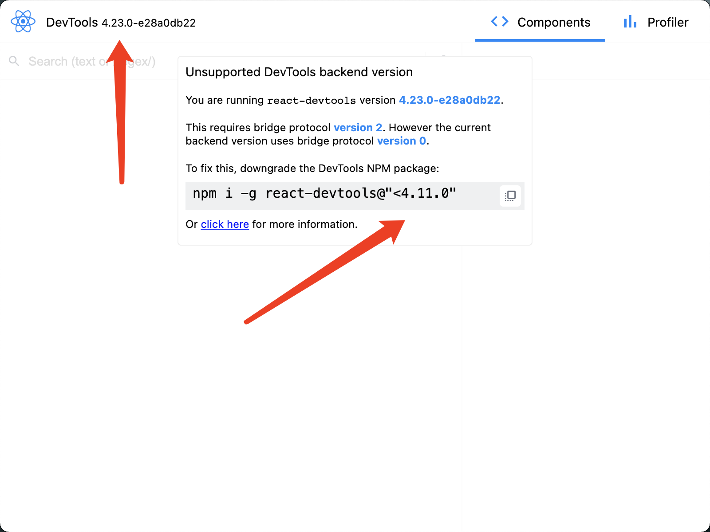
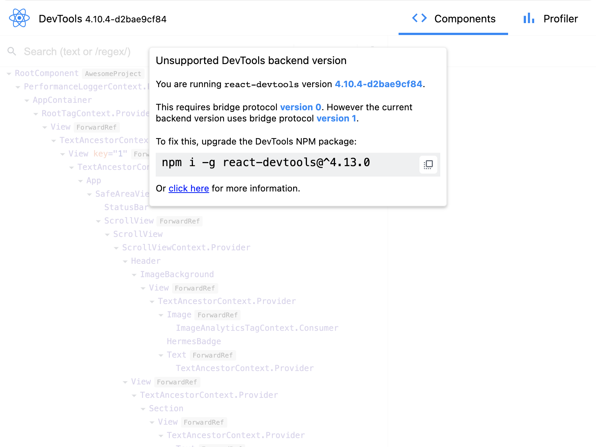

# ReactNativeShare
ReactNative学习分享

# React Native 中文网
### 环境搭建问题点【MacOs + Ios】
```
1.xcode ios模拟器下载总是中断并弹出报错【报错信息：Could not download and install iOS 15.0 Simulator. Failed to download package】
解决方法：https://blog.csdn.net/ab601026460/article/details/50409029

2.初始化React-Native项目,卡在Installing CocoaPods Dependencies
解决方案：https://www.jianshu.com/p/412d760bcacd
附：清华源：https://mirrors.tuna.tsinghua.edu.cn/help/CocoaPods/

3.同上个问题，清华源也不是很好使，改为码云源
解决方案：https://www.jianshu.com/p/a5e1b32db2bb
需要经过至少20次的执行pod install，直到将全部安装完毕大概需要半个小时。

4.homebrew加速
解决方案：https://brew.idayer.com/

5.通过yarn ios可启动项目
会有自带的debug工具，http://localhost:8081/debugger-ui/

6.xcode提示Unable to boot device in current state: Booted
解决方法：https://blog.csdn.net/weixin_30686845/article/details/96691864

7.npm 安装 electron 超时 (当前项目)
解决方案：在用户目录的 .npmrc 文件里添加一行
electron_mirror=https://npm.taobao.org/mirrors/electron/
指定 Electron 二进制文件的国内镜像（上面路径里最后一个正斜杠 "/" 别丢了）。

8.全局安装electron【报错信息：Users/gao/.config/yarn/global/node_modules/react-devtools/node_modules/electron/index.js:14
                        throw new Error('Electron failed to install correctly, please delete node_modules/electron and try installing again')
                        ^
                    
                    Error: Electron failed to install correctly, please delete node_modules/electron and try installing again
                        at getElectronPath (/Users/gao/.config/yarn/global/node_modules/react-devtools/node_modules/electron/index.js:14:11)
                        at Object.<anonymous> (/Users/gao/.config/yarn/global/node_modules/react-devtools/node_modules/electron/index.js:18:18)】

解决方案：注意他是要什么位置的electron ，根据报错提示需安装全局
yarn config set electron_mirror https://npm.taobao.org/mirrors/electron/

yarn global  add electron

9.使用react developor tools工具提示高版本需要降到低版本，降到低版本后又提示需要升到高版本 死循环。。。【未解决】

```

细心的同学发现！！！ 低版本的背景已经渲染出dom元素了 不知道为什么不让用 头大



